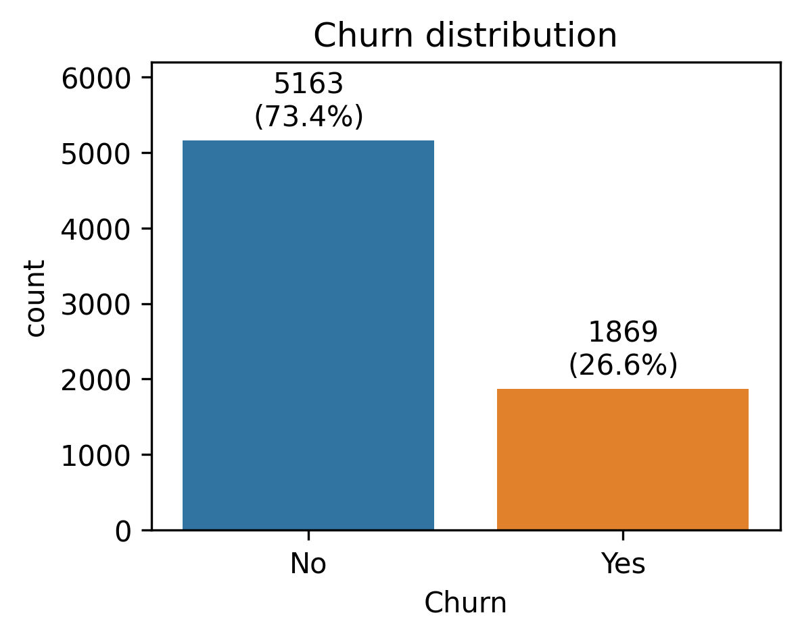
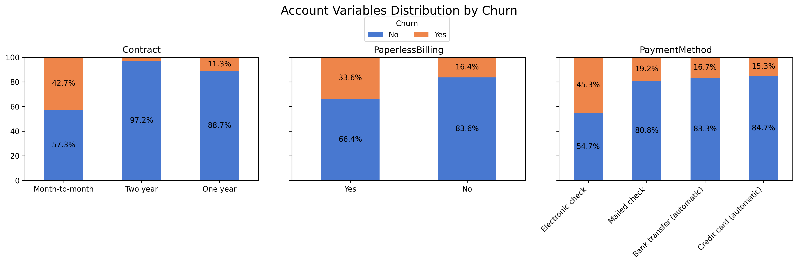
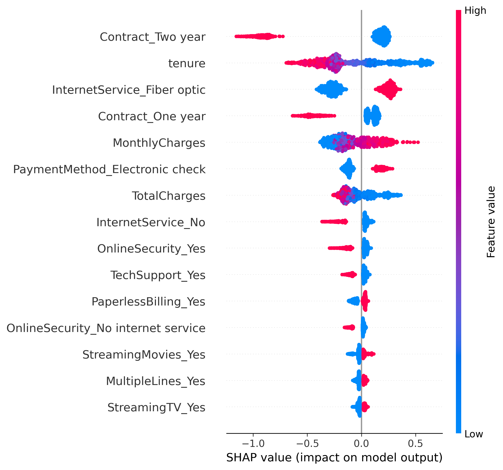

# Customer Churn Prediction Analysis  
  
Customer churn prediction analysis using EDA, statistical testing, Logistic Regression, Random Forest, and XGBoost on the Telco Customer Churn dataset.
  
## Objectives  
- Analyze churn drivers  
- Build predictive models  
- Compare model performance  
- Generate business recommendations  

## Technologies
- Python
- Pandas
- NumPy
- Matplotlib
- Seaborn
- SciPy
- Scikit-learn
- XGBoost
- SHAP
- Dython
## Dataset  
Telco Customer Churn Dataset (IBM Sample Data). Source: [Kaggle](https://www.kaggle.com/datasets/blastchar/telco-customer-churn/data)
The data set includes information about:
- Customers who left within the last month – the column is called Churn
- Services that each customer has signed up for – phone, multiple lines, internet, online security, online backup, device protection, tech support, and streaming TV and movies
- Customer account information – how long they’ve been a customer, contract, payment method, paperless billing, monthly charges, and total charges
- Demographic info about customers – gender, age range, and if they have partners and dependents

## Project Workflow  
1. Importing libraries
2. Initial inspection
3. Data cleaning
4. Exploratory Data Analysis (EDA)
    - 4.1. Target variable
    - 4.2. Numerical variables
        - 4.2.1. Descriptive statistics, histograms, box plots
        - 4.2.2. Outliers check
        - 4.2.3. Relationship with churn
    - 4.3. Categorical variables
        - 4.3.1. Demographic variables
        - 4.3.2. Services variables
        - 4.3.3. Customer account information
    - 4.4. Correlation analysis
5. Data preprocessing
6. Churn prediction analysis
    - 6.1. Baseline - Logistic regression
    - 6.2. Logistic Regression with CV tuning
    - 6.3. Random Forest
        - 6.3.1. Random Forest without TotalCharges variable
    - 6.4. XGBoost
7. Results

## Models  
- Logistic Regression
- Logistic Regression CV
- Random Forest with RandomizedSearchCV for hyperparameter tuning
- XGBoost with RandomizedSearchCV for hyperparameter tuning

## Results
| Model                           | AUC-ROC | Precision (Churn=1) | Recall (Churn=1) | F1 (Churn=1) |
| ------------------------------- | ------- | ------------------- | ---------------- | ------------ |
| Logistic Regression             | 0.8350  | 0.4909              | 0.7968           | 0.6075       |
| Logistic Regression CV          | 0.8347  | 0.4901              | 0.7968           | 0.6069       |
| Random Forest                   | 0.8380  | 0.5234              | 0.7781           | 0.6258       |
| Random Forest (no TotalCharges) | 0.8367  | 0.5196              | 0.7807           | 0.6239       |
| XGBoost                         | 0.8407  | 0.5084              | 0.8048           | 0.6232       |
- All models achieved similar predictive performance, with ROC-AUC scores ranging from 0.835 to 0.841.
- Best performing models by metric: AUC-ROC - XGBoost, Precision - Random Forest (all variables), Recall - XGBoost, F1-score - Random forest (all variables).
- The small performance differences suggest that predictive performance is driven primarily by the available customer features rather than model complexity.

## Visualizations
Churn Distribution  
  
  
Account variables distribution by churn
  
  
SHAP Summary Plot  

More visualizations are available in the notebook.

## Key Findings  
- Contract type and tenure are the strongest churn predictors.  
- Customers with month-to-month contracts are significantly more likely to churn, while long-term contracts substantially reduce churn risk.  
- Fiber optic service and higher monthly charges are associated with increased churn.
- SHAP analysis confirms that long-term contracts and higher tenure decrease churn likelihood, while fiber optic service and higher monthly charges increase churn risk.

## Business Recommendations
- Encourage migration from month-to-month contracts to longer-term plans.
- Prioritize retention campaigns for customers with short tenure.
- Investigate churn drivers among fiber optic subscribers.
- Review pricing and value perception for customers with high monthly charges.